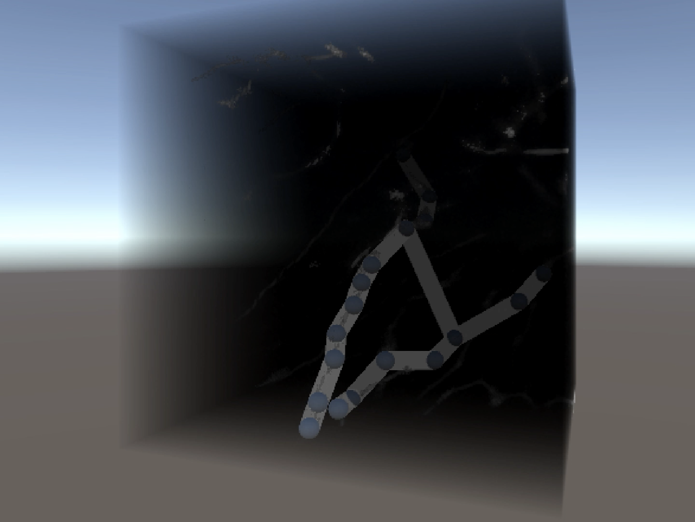
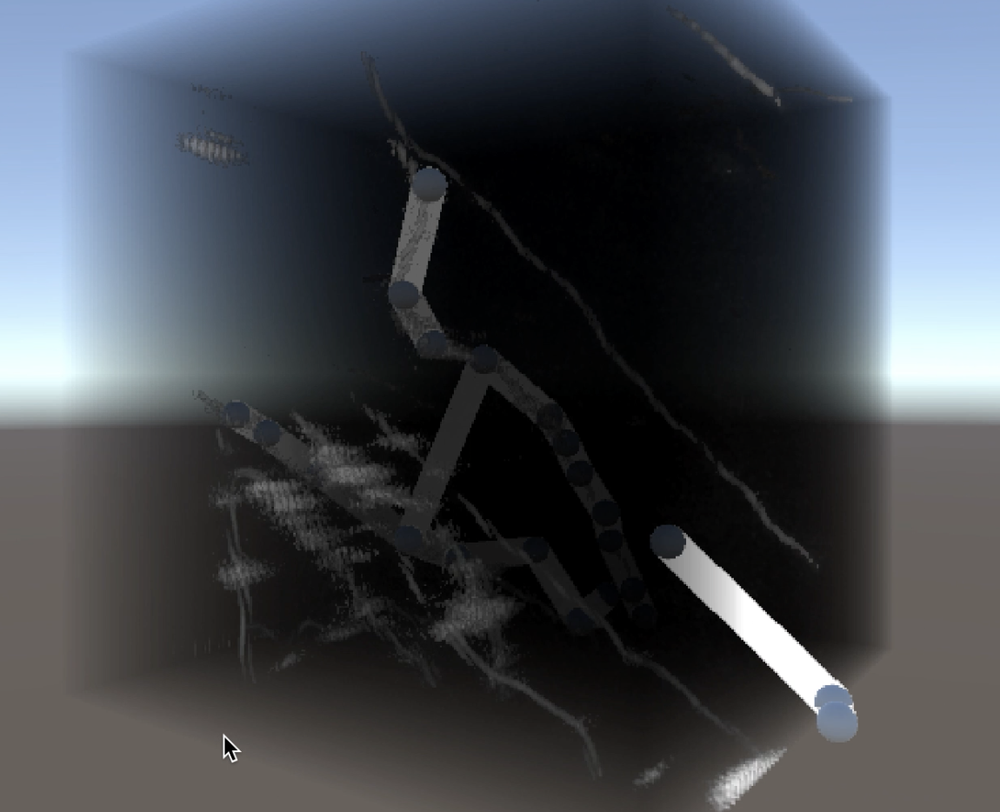

# 3D Neuron Visualization and Annotation Tool

This project is a **custom-built 3D visualization and manual annotation system** for neuron image stacks.  
Developed in **Unity**, it allows users to view, trace, and annotate neuronal structures (such as axon cross-sections) in an interactive 3D or VR environment.

---

## Overview

The tool provides the ability to:
- Stack and visualize sequential image slices of neuronal structures.  
- Interactively annotate points of interest using raycasting.  
- Trace neuronal pathways through manual point placement and connection.  
- Edit, move, and refine annotations with precision.  
- Export annotation data for analysis in external tools.

---

## Components

### StackRenderer.cs
Handles the rendering of `.png` image slices as a 3D stack of quads (planes).

**Responsibilities:**
- Aligns each slice along the z-axis with adjustable spacing.  
- Applies transparent materials to simulate depth and contrast.  
- Generates colliders dynamically for raycast interaction.  

---

### CameraOrbit.cs
Implements orbital camera movement using keyboard input (arrow keys), enabling 3D navigation around the volumetric neuron stack.

---

### RaycastDraw.cs
The main annotation controller. Handles all user interaction modes.

**Functions:**
- **Draw Mode:** Places annotation spheres on valid image pixels based on intensity thresholds.  
- **Multi-Line Annotation:** Press `Enter` to start a new neuron path.  
- **Move Mode:** Adjust sphere positions directly on planes.  
- **Connection Mode:** Links two annotation points with a line.  
- **Undo:** Removes the last annotation or connection.  
- **Export:** Saves 3D positions and metadata to a JSON file.

---

### AnnotationConfig.cs
Defines configurable parameters for annotation behavior:

| Parameter | Description |
|------------|-------------|
| `lineWidth` | Width of connecting lines. |
| `brightnessThreshold` | Minimum pixel intensity for valid annotations. |
| `clusterPixelCountThreshold` | Number of adjacent pixels above threshold required for placement. |

---

### SphereAnnotation.cs *(optional)*
Deprecated. Previously displayed floating text above spheres.  
May be removed in future builds.

### SphereAutoAnnotation.cs *(optional)*
Experimental code for automated annotation via pixel clustering.  
Currently inactive.

---

## Data Export

Annotations are stored in JSON format containing:
- 3D coordinates of all annotation spheres.  
- (Optional) classification or label metadata.

**Example:**
```json
{
  "annotations": [
    {
      "position": [0.12, 1.58, 3.24],
      "label": "axon_point"
    }
  ]
}
```


